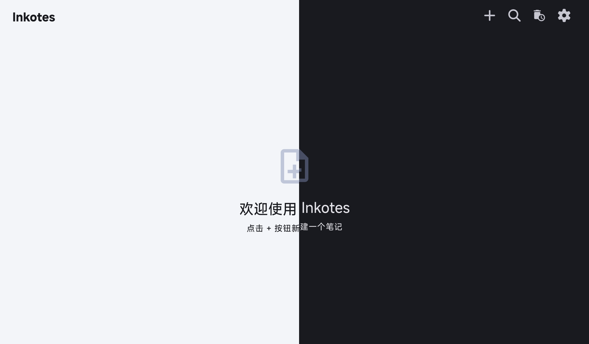
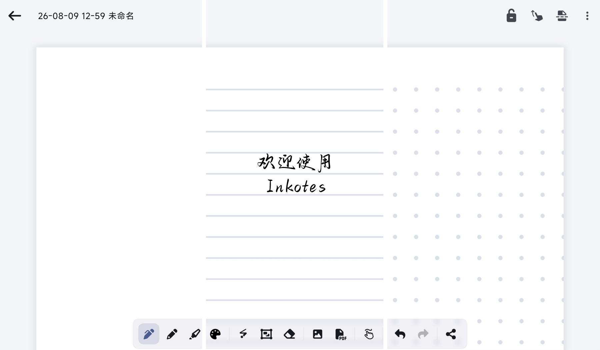

# Inkotes

一款专注于书写体验的手写笔记应用，支持 Android 与 iOS 平台。流畅的压感笔迹与随心的 PDF 批注，让记录回归纸笔般的自然。

## 功能

- **自然书写**：钢笔、铅笔、荧光笔，笔迹平滑细腻，支持压感
- **PDF 批注**：导入 PDF 文档，逐页书写与标注
- **图片插入**：插入图片并自由缩放、调整位置
- **笔记导出**：导出为 PDF、PNG 或笔记归档
- **笔记管理**：卡片式预览、支持快速搜索，改动自动保存
- **个性化**：深色 / 浅色主题，简体中文 / English 双语

## 截图

## 下载

- GitHub Releases：<https://github.com/wodel5/inkotes/releases>
- Gitee Releases：<https://gitee.com/wodel-five/inkotes/releases>

## 许可证

[GNU General Public License v3.0](LICENSE)
