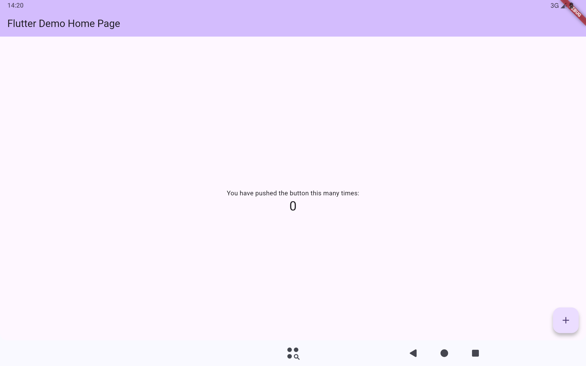

# Inkotes

Inkotes 是一款专业的手写笔记应用，提供流畅的书写体验与完善的批注功能，支持 Android 与 iOS 平台。

## 核心功能

- **手写输入**：钢笔、铅笔、高亮笔与形状笔，笔迹平滑，支持压感
- **PDF 批注**：导入 PDF 文档，逐页进行书写与标注
- **图片插入**：支持图片插入与缩放调整
- **文档导出**：支持导出为 PDF、PNG 格式
- **笔记管理**：文件夹分类、搜索与回收站
- **个性化**：深色 / 浅色主题，简体中文 / English 双语支持

## 截图

## 下载

- GitHub：<https://github.com/wodel5/inkotes/releases>
- Gitee：<https://gitee.com/wodel-five/inkotes/releases>

## 许可证

[GNU General Public License v3.0](LICENSE)
